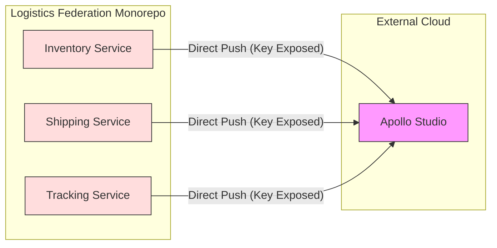

# Technical Case Study: GraphGuard Registry

### Engineering a Resilient Schema Registry for Federated Logistics

> **Role**: Lead Backend Engineer (GraphGuard)
> **Scenario**: "Logistics Federation" - A microservices-based logistics platform.

---

## 1. The Challenge

**Logistics Federation** operates a distributed architecture with three core services: `Inventory`, `Shipping`, and `Tracking`. As the team scaled, they encountered significant "Schema Drift" and deployment failures:

1.  **Race Conditions**: Multiple failing CI pipelines tried to push schema changes to Apollo Studio simultaneously.
2.  **Lack of Validation**: Invalid schemas were deployed to production, breaking the Gateway.
3.  **Security Risks**: Hardcoded Apollo API keys were scattered across 15+ microservice repositories.
4.  **No Audit Trail**: Startups had no history of _who_ deployed _what_ version.

## 2. The Solution: GraphGuard

I architected **GraphGuard**, a centralized Schema Registry Service that acts as a **Governance Gateway** between the microservices and the Apollo Platform.

### Core Objectives

- **Atomic Reliability**: Ensure local registry state and Apollo Studio are always 1:1 synced.
- **Zero-Trust Security**: Authenticate every schema push; remove all upstream credentials from client repos.
- **Governance**: Maintain a localized history of every schema version and deployment attempt.

---

## 3. Architecture Evolution

### Phase 1: The "Wild West" (Before)

_Every service talked directly to Apollo. No coordination. No security._



### Phase 2: The "GraphGuard" Gateway (After)

_Centralized governance. Atomic transactions. Secure secrets._

```mermaid
graph LR
    subgraph "Logistics Federation Monorepo"
        Inv[Inventory Service]
        Ship[Shipping Service]
        Track[Tracking Service]
    end

    subgraph "GraphGuard (My Solution)"
        API[API Gateway\n(NestJS + Fastify)]
        Auth[ApiKeyGuard\n(Security Layer)]
        Tx[Transaction Manager\n(TypeORM)]
        DB[(PostgreSQL\nRegistry)]
    end

    subgraph "External Cloud"
        AS[Apollo Studio]
    end

    %% Flows
    Inv -- "1. Deploy (Secure Token)" --> Auth
    Ship -- "1. Deploy (Secure Token)" --> Auth
    Track -- "1. Deploy (Secure Token)" --> Auth

    Auth --> API
    API -- "2. Persist State (Atomic)" --> Tx
    Tx --> DB
    Tx -- "3. Sync (Upstream Key)" --> AS

    style GraphGuard fill:#e1f5fe,stroke:#01579b,stroke-width:2px
    style Auth fill:#fff9c4,stroke:#fbc02d
    style Tx fill:#c8e6c9,stroke:#388e3c
```

---

## 4. Key Engineering Decisions

### 4.1. Atomic Distributed Transactions

**Problem**: If we save the schema locally but Apollo Studio is down, our database says "Success" but reality says "Fail".
**Solution**: I implemented a **Two-Phase-Like Commit** using database transactions.

```typescript
// Code Snippet: Ensuring Atomicity
return this.schemaRepo.manager.transaction(async (manager) => {
  // Step 1: Persist 'Pending' state to PostgreSQL
  const version = await manager.save(SchemaVersion, ...);

  // Step 2: Attempt Upstream Sync
  try {
     await this.apolloService.publish(sdl);
  } catch (e) {
     // ROLLBACK! The local version is never committed.
     throw new Error("Upstream Sync Failed - Rolling Back");
  }

  // Step 3: Commit Transaction
});
```

### 4.2. Secure Orchestration

**Problem**: Developers copy-pasting `APOLLO_KEY` into every `github-ci.yml`.
**Solution**:

1.  **Token Exchange**: Services use a revocable `X-API-KEY` (GraphGuard Token).
2.  **Secret Isolation**: The sensitive `APOLLO_KEY` lives _only_ in GraphGuard's encrypted environment variables.
3.  **Strict Guards**: Implemented a NestJS `CanActivate` guard to reject any request without a valid active key.

---

## 5. Technology Stack

| Component     | Technology              | Reasoning                                                             |
| :------------ | :---------------------- | :-------------------------------------------------------------------- |
| **Framework** | **NestJS**              | Enterprise architecture, modularity, and powerful Decorator support.  |
| **Language**  | **TypeScript**          | Strict type safety for complex schema objects.                        |
| **Database**  | **PostgreSQL**          | Relational integrity for Versions covering 100+ deployments.          |
| **ORM**       | **TypeORM**             | Transaction management and Entity migrations.                         |
| **API**       | **GraphQL (Mercurius)** | Fastify-based GraphQL adapter for high-performance schema processing. |

---

## 6. Verification Results

| Test Scenario           | Result                            |
| :---------------------- | :-------------------------------- |
| **Unauthorized Access** | ✅ BLOCKED (401)                  |
| **Schema Validation**   | ✅ VALIDATED (Apollo Engine)      |
| **Atomic Rollback**     | ✅ VERIFIED (No orphaned records) |
| **Federation Sync**     | ✅ SUCCESS (Subgraphs composed)   |

---

_Generated for Portfolio & Resume Documentation_
